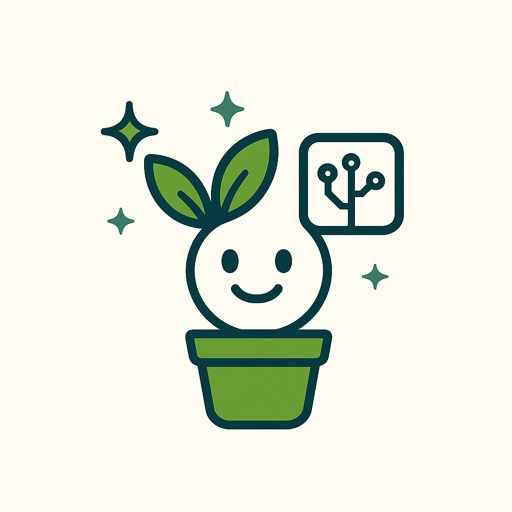

🌿 Verna: Your Intelligent AI-Powered Plant Care Companion

  

 <strong>An elegant, multi-platform ecosystem bridging Botany, Artificial Intelligence, and Smart IoT to revolutionize how we grow, nurture, and save our green friends.</strong> 

    

🌍 Overview
Verna is a complete, enterprise-grade plant care and diagnostics platform designed for both casual gardeners and botanic enthusiasts. Built on a powerful, decoupled architecture—featuring a robust Django REST Framework (DRF) backend, a sophisticated React web application, and a stunning React Native Expo mobile app—Verna turns any smartphone or web browser into a professional horticulturist.
By utilizing state-of-the-art vision and language models, Verna helps users identify species, diagnose diseases, obtain curated lifestyle recommendations, track growth indicators over time, and consult a dedicated plant-specific AI assistant.
⚡ Core Features
1. 📸 Precise AI Plant Identification
Instant Classification: Snap a photo of any indoor or outdoor plant. Verna's advanced vision model analyzes leaf structures, venation patterns, and floral characteristics to instantly identify the species.
Botanical Wiki: Generates a comprehensive care profile including scientific nomenclature, origin, watering frequency, optimal soil mixture, humidity demands, and toxicity reports.
2. 🏥 AI Disease Diagnosis & Treatment Clinic
Symptom Recognition: Upload an image of an ailing plant (e.g., yellowing leaves, mildew, root rot, leaf spots).
Step-by-Step Remedies: The AI engine identifies the pathogen (fungal, bacterial, viral, or pest) or nutrient deficiency and delivers immediate, actionable treatment steps, chemical/organic solutions, and prevention strategies.
3. 🎯 Personalized Plant Recommender (Matchmaker)
Tailored Lifestyle Wizard: Takes users through a highly interactive, dynamic questionnaire analyzing their living space, daily schedules, light availability, pet safety constraints, geographical climate, and budget.
Curated Match: Verna's recommendation algorithm selects the absolute best plant match, ensuring high survival rates and stress-free care.
4. 🪴 My Virtual Garden, Growth Tracking & Prevalent Context AI
Digital Garden Log: Add plants to your personal collection with personalized names and custom placements.
Dynamic Growth Tracker: Periodically record plant dimensions (height, canopy width, pot volume, health score) to render custom analytics and growth progress visualization.
Context-Aware Plant Chatbot: Have a live conversation with an AI model that knows exactly who it is talking to. The chatbot retrieves the comprehensive database history, periodic measurements, and historical watering cycles of that specific plant in your garden, offering hyper-personalized, context-rich advice.
🔮 The Future: IoT-Enabled Smart Gardening
Our long-term roadmap elevates Verna from a digital log to a physical smart ecosystem:
Verna Smart Pots & Irrigation Modules: Proprietary hardware integrating soil moisture meters, lux (light) sensors, ambient humidity monitors, and automatic drip systems.
Dynamic Automated Watering: Verna's AI logic processes raw hardware data in real-time, dictating watering schedules tailored to the plant species' exact status.
Socioeconomic Packaging (Democratized Tech): We are designing modular IoT layers. Users can choose from a minimalist "Sensor-Only" budget kit to a "Flagship Automated Self-Watering" system—making smart hardware accessible to all income classes.
🛠️ Architecture & Tech Stack
Verna is engineered using a robust, clean, and highly scalable stack:
🏛️ Backend Architecture
Framework: Django & Django REST Framework (DRF)
Database: PostgreSQL (Production) / SQLite (Development)
LLM & AI Integration: State-of-the-art visual models for classification alongside large language models for generating tailored care procedures and contextual chat support.
Background Workers: Django management commands and task schedulers to dispatch timely push notifications and care reminders.
🌐 Web Frontend (plants_site)
Framework: React.js (Vite + TypeScript)
Styling: Tailwind CSS for fluid layouts, interactive carousels, and responsive dashboards.
Animations: Clean visual cues, micro-interactions, and premium charts displaying plant health and development history.
📱 Mobile App (plants_app)
Framework: React Native with Expo (TypeScript)
UI Library: Gluestack UI / NativeWind for native performance and a unified glassmorphism aesthetic.
Key Integrations: Native camera access, persistent storage, global state context managers, and responsive multilingual systems (EN/FA).
📂 Project Structure
├── Backend/                 # Django core, DB migrations, ML views, and API layers
│   ├── blog/                # Community articles and plant blogs
│   ├── diseases/            # Disease diagnosis models and lookup databases
│   ├── gardens/             # Virtual garden, growth tracking, and Context AI Chat
│   ├── plants/              # Global plant dictionary, identification, and matching
│   └── users/               # Custom user model, OTP handling, and profile services
├── Frontend/
│   ├── plants_site/         # Fully responsive React.js web portal
│   └── plants_app/          # Native React Native Expo mobile application
└── README.md

⚙️ Quick Start Installation
Prerequisites
Ensure you have the following installed on your local machine:
Python 3.10+
Node.js (v18+)
Expo Go App (for testing mobile live on your phone)
Step 1: Fire up the Django Backend
Navigate to the backend directory:
cd Backend

Create and activate a python virtual environment:
python -m venv venv
# On macOS/Linux:
source venv/bin/activate
# On Windows:
venv\Scripts\activate

Install dependencies:
pip install -r requirements.txt

Copy the .env.example file and configure your local settings:
cp .env.example .env

Apply database migrations and seed the database with initial plants:
python manage.py migrate
python manage.py populate_plants
python manage.py populate_diseases

Spin up the development server:
python manage.py runserver

Step 2: Spin up the Web App (React)
Navigate to the site folder:
cd Frontend/plants_site

Install package dependencies:
npm install

Configure API base URL in your local environment files.
Launch the developer web server:
npm run dev

Step 3: Launch the Mobile Application (Expo)
Open the app directory:
cd Frontend/plants_app

Install dependencies:
npm install

Run the Expo dev server:
npx expo start

Use your camera to scan the QR code displayed on your terminal inside the Expo Go app to test live on iOS or Android.
💎 Proposed Monetization Strategy
To keep Verna's ecosystem sustainable and scale the research of IoT devices, we proposes a multi-channel revenue plan:
Freemium Plan (Verna VIP Subscription): Basic users get free monthly plant identifications and access to the global plant library. Subscribing to Premium unlocks unlimited AI disease diagnostics, custom growth progress charts, and unlimited context-aware AI chatbot sessions.
E-Commerce and IoT Sales: Direct-to-consumer sales of the Verna Smart Pots, plug-and-play moisture sensors, and automated drip adapters.
Hyperlocal Partner Marketplace: Connecting local nurseries, florists, and plant shops to Verna's user base, charging a micro-commission on sales driven by Verna's custom matching recommender.
🤝 Contributing
Contributions make the open-source community an amazing place to learn, inspire, and create. Any contribution you make to Verna is highly appreciated.
Fork the Project.
Create your Feature Branch (git checkout -b feature/AmazingFeature).
Commit your Changes (git commit -m 'Add some AmazingFeature').
Push to the Branch (git push origin feature/AmazingFeature).
Open a Pull Request.
📜 License
Distributed under the MIT License. See LICENSE for more information.
💚 Contact & Showcases
Project Repository: https://github.com/petrosbid/plant-caring-app
Platform Developer: [Your Name / Team]
Support Email: info@verna-app.com
Let's make our world greener, one smart leaf at a time. 🌱
